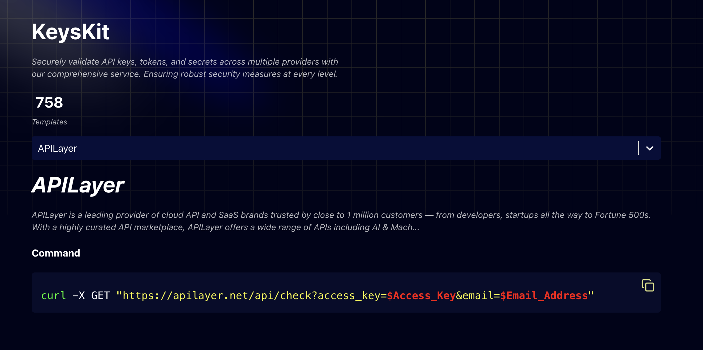

# 🔐 Keyskit — API Keys Validation

**Keyskit** is a lightweight tool built for bug bounty hunters and developers to quickly test if an API key is valid — no need to dig through docs or write a script.

Just select a provider, copy the command, and test it locally on your own terminal.

---

## ✨ Features?

- 🧪 Ready-to-use `curl` commands copy & test
- 🔍 Supports many common providers
- ⚡ Lightweight and easy to use

---

## 🌐 Try it online

👉 Visit [**kkit.io**](https://kkit.io) and test your API keys in seconds.

---

## 📸 Preview

---

## 🛠️ For Contributors

Want to add more providers or improve existing ones? Pull requests are welcome.

---

## 💖 Support the Project

If you found this tool useful, consider buying me a coffee to support its development:

---
## ⚠️ Legal

Keyskit is meant for **educational and legitimate testing purposes only**. Always make sure you’re testing keys you own or have permission to test.

---

## 📄 License

Licensed under the [MIT License](LICENSE).
